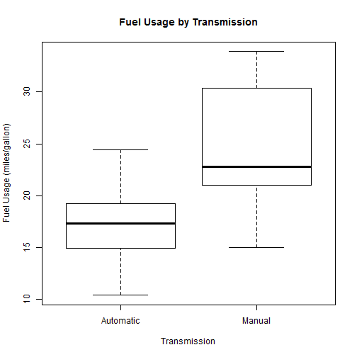
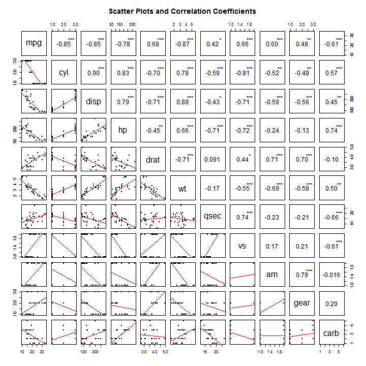
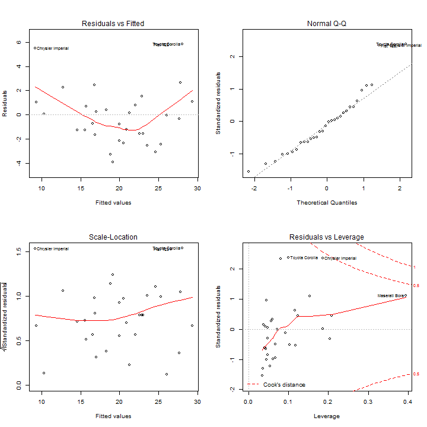

### Motor Trends - Regression Models Project by Roland Nieuwenhuizen 

#### 1 Executive Summary 
In this analysis the relation between Fuel Usage (MPG) and Transmission (Automatic and Manual) has been investigated based on the Motor Trend Car Road Tests dataset. A first look suggests that there is such a relation indeed. But a closer look, which takes confounding factors into account by means of a linear regression model, learns that there is little or no evidence for this relation. So from **this particular data** can't be concluded whether automatic or manual transmission is better for MPG. In the derived model, MPG only depends on Horsepower and Weight. Therefore it is not possible to quantify the MPG difference between automatic and manual transmissions.

#### 2 Data Loading and Basic Exploratory Data Analyses
The data is loaded and the nominal and ordinal variables are turned into factors.


```r
data(mtcars)
mtcars$cyl <- factor(mtcars$cyl)
mtcars$vs <- factor(mtcars$vs)
mtcars$am <- factor(mtcars$am,labels=c("Automatic","Manual"))
mtcars$gear <- factor(mtcars$gear)
mtcars$carb <- factor(mtcars$carb)

t <- t.test(mpg ~ am, data = mtcars)$p.value
```

Then some preliminary analyses on the Transmission variable has been done, the details are shown in Appendix 1.
From this first analysis it seems that an automatic transmission results in a higher fuel usage. Moreover this difference is significant (the corresponding p-value is 0.001).

However, when we have a closer look at the interaction between the variables, it appears that Transmission is highly correlated with other variables in the data set. Appendix 2 shows an overview of all interactions. In particular Transmission has much interaction with Weight (cars with automatic transaction tend to be heavier) and rear axle ratio (drat). This justifies a more advanced analysis in which the relationship with the other variables is removed from both Fuel Usage and Transmission.This is accomplished by linear regression.

#### 3 An Initial Linear Model

All of the variables are used to fit a first model. This model is reduced using the step-function. The step-function uses the Akaike information criterion (AIC) to select the relatively best model out of all the possible models. For more information on the AIC have a look here: `https://en.wikipedia.org/wiki/Akaike_information_criterion`

```r
fit.total <- lm(mpg ~ . , data = mtcars)
fit.aic <- step(fit.total, direction = "both", trace = 0)
summary(fit.aic)$coefficients
```

```
##                Estimate Std. Error   t value     Pr(>|t|)
## (Intercept) 33.70832390 2.60488618 12.940421 7.733392e-13
## cyl6        -3.03134449 1.40728351 -2.154040 4.068272e-02
## cyl8        -2.16367532 2.28425172 -0.947214 3.522509e-01
## hp          -0.03210943 0.01369257 -2.345025 2.693461e-02
## wt          -2.49682942 0.88558779 -2.819404 9.081408e-03
## amManual     1.80921138 1.39630450  1.295714 2.064597e-01
```

As AIC only gives a relative estimate and tells nothing about the absolute quality of the model, further tests are necessary. As can be seen from the p-values of the coefficients, the evidence that the coefficents for Transmission and 8-Cylinders differ from zero is rather week (p-values 0.21 and 0.35 respectively). Therefore in the next section some models are tested that exclude these variables.

#### 4 Model Selection

Based on the model in the previous section some nested model are defined. Then analyses of variance is used to determine whether each inclusion improves the model significantly.


```r
fit1 <- lm(mpg ~ hp + wt, data = mtcars)
fit2 <- lm(mpg ~ hp + wt + cyl, data = mtcars)
fit3 <- lm(mpg ~ hp + wt + cyl + am, data = mtcars)

anova(fit1,fit2,fit3)$`Pr(>F)`[c(2,3)]
```

```
## [1] 0.07004986 0.20645967
```

```r
r <- summary(fit1)$adj.r.squared
```

Because there is hardly any evidence that adding Number of Cylinders or Transmission (or both) to the model does improve the model significantly (p-values are 0.07 and 0.21 respectively), they are left out because one of the aims is a parsimonious model. This final model, with Horsepower and Weight as predictors, has an overal Adjusted R-Squared of 0.815.

#### 5 Residual Diagnostics and Interpretation and Uncertainty in the Coefficients 

As can be seen from the plots in Appendix 3 the residuals seem to be rather randomly distributed, implying a qualitatively good model. The following table shows the coefficients and their confidence intervals.


```r
cbind(coefficients(fit1),confint(fit1))
```

```
##                               2.5 %      97.5 %
## (Intercept) 37.22727012 33.95738245 40.49715778
## hp          -0.03177295 -0.05024078 -0.01330512
## wt          -3.87783074 -5.17191604 -2.58374544
```

So keeping the others constant, 1 unit increase in Horsepower decreases Fuel Usage with 0.03 mpg (with 95% certainty between -0.05 and -0.01). And keeping the others constant, 1 unit (1000 lbs) increase in Weight decreases Fuel Usage with 3.9 mpg (with 95% certainty between -5.2 and -2.6).

### Appendix 1 - Analyses of Fuel Usage for Different Transmissions


```r
boxplot(mpg ~ am, data = mtcars,
        xlab = "Transmission", ylab = "Fuel Usage (miles/gallon)",
        main = "Fuel Usage by Transmission"        
)
```



### Appendix 2 - Interaction between Variables


```r
pairs(mtcars,lower.panel=panel.lm, upper.panel=panel.cor, 
      pch=20,main="Scatter Plots and Correlation Coefficients")
```



Signif. codes:  0 = *** 0.001 = ** 0.01 = * 0.05 = .

### Appendix 3  - Residual Diagnostics Plots


```r
par(mfrow = c(2,2))
plot(fit1)
```


